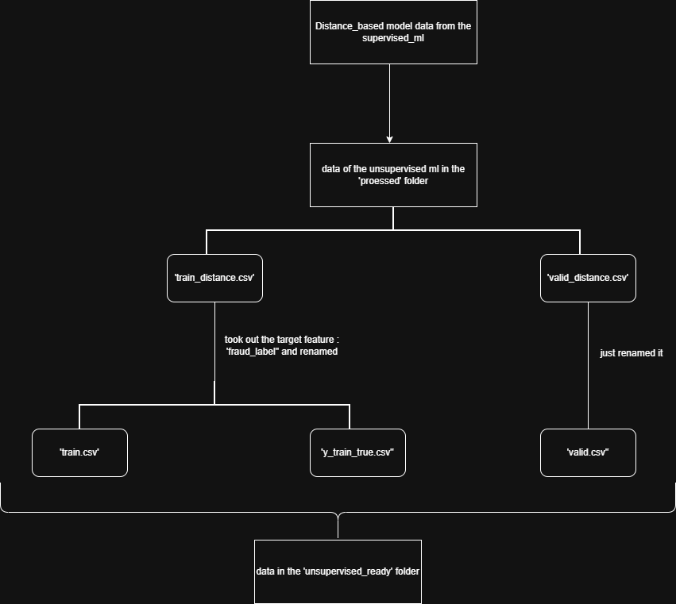

### ------------ Folder name : Data --------------------

- here is all the information about the data folder, the way folder is structured and the stuff inside each one of them

- Inside the folder we have 2 subfolders : 

1. processed : it has the fully processed distance based data from the supervised ml phase, the files inside are (train_distance.csv) and (valid_distance.csv)

2. Unsupervised_ready : in this folder, we have the unsupervised ml ready data, which technically is further processing applied on the data in the processed folder i.e. we seprated the target feature 'fraud_label' from the 'train_distance.csv' meanwhile, the rest 'valid_distance' was same as it is with just name being changed to 'valid.csv'

- to undertsand more, look at the figure below : 

